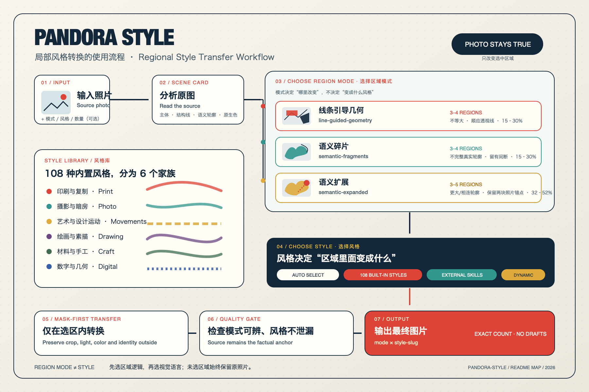
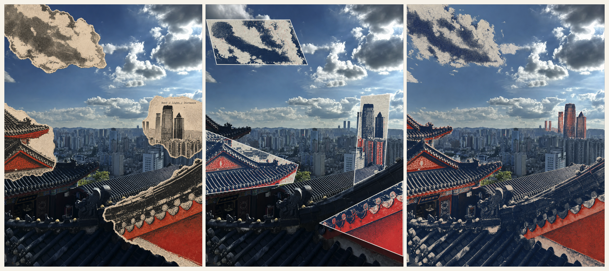

# Pandora Style

**Source-aware regional photo stylization for Codex.** Keep the photograph truthful outside selected regions, while applying print, photographic, drawing, craft, digital, poster, zine, external, or dynamically created styles inside them.

**面向 Codex 的照片局部风格转换 Skill。** 

未选区域保留真实照片，只在由原图结构或语义轮廓决定的区域内改变视觉风格。

[中文说明](#中文说明) · [English Guide](#english-guide) · [Skill Instructions](SKILL.md) · [MIT License](LICENSE)

<p align="center">
  
</p>

<p align="center">
  
</p>

<p align="center"><sub>从左到右：<code>semantic-fragments</code>、<code>line-guided-geometry</code>、<code>semantic-expanded</code>。同一照片与相近视觉语言，不同区域逻辑。<br>Left to right: <code>semantic-fragments</code>, <code>line-guided-geometry</code>, and <code>semantic-expanded</code>. Same source and related visual language, different mask logic.</sub></p>

## What is included / 包含内容

- 3 source-aware region modes / 3 种来源感知区域模式
- 108 self-contained built-in styles / 108 种可独立使用的内置风格
- Adapters for separately installed external Style Skills / 外部 Style Skill 局部适配能力
- Dynamic style creation through compatible visual engines / 动态创建原创区域风格
- Source-aware color selection and a mask-first quality gate / 来源感知配色与 Mask-First 质量检查

> [!IMPORTANT]
> The 108 built-in styles work after installing this repository alone. Selectors beginning with `external:` require the corresponding Style Skill to be installed separately.
>
> 只安装本仓库即可使用 108 种内置风格。所有以 `external:` 开头的选择器都需要另外安装相应的 Style Skill。

---

# 中文说明

## 简介

`pandora-style` 会先分析照片的主体、构图、透视、结构线、视觉重量、原生色彩与物体轮廓，再选择少量和原图有关的区域，只在这些区域内改变视觉语言。

核心公式是：

```text
区域模式决定“哪里改变、外轮廓是什么”
风格决定“区域内部如何表现”
未选区域继续保留原照片
```

因此，同一种 Riso、蓝晒、水墨或拼贴风格，可以分别放进几何切片、克制语义碎片或扩展语义区域；视觉材质可以一致，但区域形态和覆盖程度必须明显不同。

适合制作：

- 写实摄影与抽象视觉并存的艺术图片
- 局部印刷、绘画、拼贴、材料或数字效果
- 同一照片在不同区域模式下的对照实验
- 将其他完整 Style Skill 局部套用到照片中
- 根据照片动态创造新的视觉语言

## 三种区域模式

| 模式 | 区域逻辑 | 通常数量 | 通常覆盖 | 适合照片 |
|---|---|---|---|---|
| `line-guided-geometry` | 顺应原图结构线的几何切片 | 3–4 | 15–30% | 建筑、城市、街景、室内、道路 |
| `semantic-fragments` | 不完整的真实物体或自然轮廓 | 3–4 | 15–30% | 云、烟、水、人物、植物、材质、倒影 |
| `semantic-expanded` | 更大或相互呼应的语义轮廓 | 3–5 | 32–52% | 更沉浸、更完整、更接近独立艺术作品的处理 |

### `line-guided-geometry`

沿照片中的地平线、屋檐、街道、建筑垂线、阴影或透视轴创建不等大的几何区域。

- 可使用长方形、梯形、平行四边形、三角形或楔形。
- 尺寸与长宽比应有变化，不默认使用正方形。
- 以视觉重量为准，不做平均分格。
- 可以有少量重叠，但不应形成整齐网格。
- 避免随意漂浮的几何形、每行每列一个方块和过大的角落色块。

### `semantic-fragments`

沿云、烟、人物、植物、建筑、屋檐、倒影、阴影或材质边缘建立克制、不完整的语义区域。

- 默认选择物体的一部分，而不是完整抠图。
- 保留断口、空隙、遮挡、雾气和反射衰减。
- 外轮廓必须能够追溯到真实物体或自然现象。
- 避免矩形面板、贴纸边缘、完整孤立剪影和无来源的圆滑色块。

### `semantic-expanded`

使用同样的语义轮廓逻辑，但建立更大或相互呼应的区域。

- 可以处理一个接近完整的物体或物体群。
- 区域之间可以通过方向、节奏或材质形成联系。
- 必须保留至少两个位于不同位置的大块真实照片区域。
- 仍需保留渐隐边缘、遮挡、断口或原片空隙。
- 不允许演变成全图滤镜，也不能同时转换所有主要场景层。

## 108 种内置风格

108 种内置风格随本仓库一起安装，不依赖其他 Style Skill。它们分为 6 个家族，每个家族 18 种：

| 风格家族 | 数量 | 典型方向 | 目录 |
|---|---:|---|---|
| 印刷与复制 | 18 | Riso、复印、网点、版画、档案纸张、图形纹理 | [`styles-print.md`](references/styles-print.md) |
| 摄影与暗房 | 18 | 胶片、曝光、化学显影、色调、光学效果 | [`styles-photo.md`](references/styles-photo.md) |
| 艺术与设计运动 | 18 | 明确的构图语法与历史图形语言 | [`styles-movements.md`](references/styles-movements.md) |
| 绘画与手绘 | 18 | 水墨、水彩、炭笔、线稿、颜料、手工笔触 | [`styles-drawing.md`](references/styles-drawing.md) |
| 材料与工艺 | 18 | 纸艺、纺织、刺绣、玻璃、陶瓷、马赛克 | [`styles-craft.md`](references/styles-craft.md) |
| 数字与几何 | 18 | 像素、故障、镶嵌、计算结构、几何系统 | [`styles-digital.md`](references/styles-digital.md) |

完整索引与自动选择规则见 [`references/style-index.md`](references/style-index.md)。

## 外部 Style Skills

外部 Style Skill 不包含在本仓库中。只有当对应 Skill 已安装并可被 Codex 发现时，`pandora-style` 才能读取并局部适配它。

常用选择器：

| Selector | 区域内提取的主要语言 | 安装状态 |
|---|---|---|
| `external:gc-minimal-zine-poster-v0-1` | 极简纸刊、网点、复印磨损、克制文字 | [LiamGvchi/gc-minimal-zine-poster](https://github.com/LiamGvchi/gc-minimal-zine-poster) · MIT |
| `external:scenes-gathered-zine-v1-3` | 真实照片与纸面插画连续性、撕纸或印刷过渡 | [Zeejay0/gathered-scenes-zine-skill](https://github.com/Zeejay0/gathered-scenes-zine-skill) · 仅限个人非商业使用 |
| `external:ni-poster/scene-distillation` | 来源明确的插画提炼与视觉隐喻 | [Upstream](https://github.com/ttttstc/ni-skill) |
| `external:ni-poster/photo-abstract-editorial` | 干净的编辑抽象与记忆面板 | [Upstream](https://github.com/ttttstc/ni-skill) |
| `external:photo-riso-poster` | 2–3 色 Riso、来源证据与印刷节奏 | [Upstream](https://github.com/luckdvr/photo-riso-poster) |
| `external:ink-wash-poster` | 当代水墨、水分、吸收、宣纸与克制编辑标记 | [Upstream](https://github.com/TwentyfiveBTea/ink-wash-poster) |
| `external:photo-evidence-ledger` | 几何、间距与色彩证据标本 | [Upstream](https://github.com/byJming/photo-skills-atelier) |
| `external:photo-small-world-revival` | 稀疏手绘、主体与陪伴物关系 | [Upstream](https://github.com/byJming/photo-skills-atelier) |
| `external:torn-paper-collage-poster` | 撕纸、档案碎片、胶带、印章与复印颗粒 | [Upstream](https://github.com/agentara/skills/tree/main/skills/aigc/torn-paper-collage-poster) |

其他支持内容包括：

- `external:editorial-vision-studio/<variant>`：编辑视觉风格与预设。
- `external:canvas-design`：根据照片创建原创视觉哲学。
- `external:algorithmic-art`：创建计算艺术风格系统。
- `external:theme-factory/<theme>`：提供调色板与字体倾向，需要和一种实际媒介组合。

完整选择器、变体、来源和许可证见 [`references/external-style-skills.md`](references/external-style-skills.md)。第三方 Skill 保留各自的许可证，本仓库的 MIT License 不会替代它们。

> 注意：`external:gc-minimal-zine-poster-v0-1` 是为旧提示词保留的兼容选择器；其上游仓库当前发布的 Skill 名称为 `gc-minimal-zine-poster-v0-3`。`scenes-gathered-zine-v1-3` 的上游许可证只允许个人非商业使用；商业、客户、公司或机构用途需要先取得作者书面许可。

## 安装

### 推荐方式：直接克隆到 Codex Skills 目录

```bash
mkdir -p "${CODEX_HOME:-$HOME/.codex}/skills"
git clone https://github.com/Zhizhou-Cao/pandora-style.git \
  "${CODEX_HOME:-$HOME/.codex}/skills/pandora-style"
```

安装完成后重启 Codex，使新会话重新发现该 Skill。

### 更新

如果使用上面的 Git 安装方式：

```bash
git -C "${CODEX_HOME:-$HOME/.codex}/skills/pandora-style" pull --ff-only
```

更新后再次重启 Codex。

### ZIP 手动安装

1. 在 GitHub 点击 **Code → Download ZIP**。
2. 解压并确认文件夹名为 `pandora-style`。
3. 将整个文件夹放到 `${CODEX_HOME:-$HOME/.codex}/skills/`。
4. 确认最终路径是：

```text
~/.codex/skills/pandora-style/SKILL.md
```

不要出现下面这种嵌套结构：

```text
~/.codex/skills/pandora-style/pandora-style/SKILL.md
```

## 验证安装

在终端检查：

```bash
test -f "${CODEX_HOME:-$HOME/.codex}/skills/pandora-style/SKILL.md" \
  && echo "pandora-style installed"
```

然后在新的 Codex 任务中附上一张照片并发送：

```text
用 $pandora-style 处理这张照片。
模式使用 semantic-fragments。
自动选择一种内置风格。
生成一张最终图片。
```

## 常用调用方式

### 指定模式与内置风格

```text
用 $pandora-style 处理这张照片。

模式使用 line-guided-geometry。
风格使用 cyanotype-blueprint。
生成一张最终图片。
```

### 使用外部风格

```text
用 $pandora-style 处理这张照片。

模式使用 semantic-expanded。
风格使用 external:photo-riso-poster。
生成一张最终图片。
```

### 自动选择不同家族的风格

```text
用 $pandora-style 处理这张照片。

模式分别使用 line-guided-geometry 和 semantic-fragments。
从 108 种内置风格中选择最适合照片的两种，
两种风格不要来自同一个家族。
每种模式与每种风格生成一张，共四张最终图片。
生成前先告诉我选择的风格和理由。
```

### 三种模式对照

```text
用 $pandora-style 处理这张照片。

使用同一种风格，分别生成：
- line-guided-geometry
- semantic-fragments
- semantic-expanded

保持颜色、材质和抽象程度一致，共生成三张最终图片。
```

### 动态创建原创风格

```text
用 $pandora-style 处理这张照片。

模式使用 semantic-expanded。
调用 external:canvas-design，
根据照片创建一种原创视觉语言并生成一张图片。
```

## 自动分析与配色

每次处理前，Skill 会建立一个 Scene Card，记录：

- 核心主体与辅助元素
- 构图、透视和空间关系
- 主导线条与视觉重量
- 安静区域与密集区域
- 原生主色与有意义的小面积色彩
- 几何候选线与语义候选轮廓

配色优先级：

1. 强化照片中已有的有意义小面积色彩。
2. 使用与原图相近但更明确的色彩。
3. 原图缺少可用颜色时，加入克制的互补色。
4. 只有媒介本身要求时才使用固定工艺色，例如蓝晒蓝。
5. 只有用户明确要求时才完全随机。

区域模式不会决定颜色。比较不同模式时，应保持风格、添加色、材质和抽象程度一致。

## 输出与质量检查

每张最终图片使用 `mode × style-slug` 标注。Skill 会检查：

- 未选区域是否继续保持原片的画幅、视角、透视、光线、色彩和主体身份。
- 风格是否泄漏到整个画面。
- 几何模式与语义模式能否通过外轮廓区分。
- 两档语义覆盖是否符合各自范围。
- 添加的颜色是否来源明确并具有结构作用。
- 是否出现无关文字、边框、新物体、假水印或错误数量。

如果结果出现明确失败，Skill 最多针对该问题修正一次。被拒绝的草稿不计入用户要求的最终图片数量。

## 运行要求

- 能够读取用户提供照片的 Codex 环境。
- 可用的图片生成或图片编辑能力。
- 写入项目文件时，需要对应目录的写入权限。
- 使用外部 selector 时，对应 Style Skill 必须已经安装。

`pandora-style` 是一个工作流和视觉决策 Skill，不包含独立的图像生成模型。

## 常见问题

### Codex 找不到 `$pandora-style`

- 确认最终路径是 `~/.codex/skills/pandora-style/SKILL.md`。
- 检查是否出现重复嵌套文件夹。
- 重启 Codex，并在新任务中再次调用。

### 外部 selector 不可用

外部 Skill 没有安装，或安装名称与 registry 中的 selector 不一致。安装对应 Skill，或者改用 108 种内置风格。

### 两种模式生成得太像

要求保持风格与色彩一致，只改变区域逻辑；同时明确检查外轮廓：几何模式必须是来源线条引导的多边形，语义模式必须是不完整的真实轮廓。

### 整张照片都被改变了

重新强调使用 Mask-First：只改变选中区域；`semantic-expanded` 也必须保留至少两个明显的原片锚点。

### 生成数量不正确

明确写出组合逻辑和最终总数，例如“两种模式 × 两种风格，共四张最终图片”。

## 仓库结构

```text
pandora-style/
├── SKILL.md
├── README.md
├── LICENSE
├── agents/
│   └── openai.yaml
├── images/
│   ├── workflow.png
│   └── example.png
└── references/
    ├── style-index.md
    ├── external-style-skills.md
    ├── styles-print.md
    ├── styles-photo.md
    ├── styles-movements.md
    ├── styles-drawing.md
    ├── styles-craft.md
    ├── styles-digital.md
    └── sources.md
```

---

# English Guide

## Overview

`pandora-style` analyzes the subject, composition, perspective, structural lines, visual weight, native colors, and semantic contours of a photograph. It then changes the visual language only inside a small set of source-aware regions.

Its core model is:

```text
Region mode decides where transformation occurs and defines the outer mask.
Style decides how the inside of the mask is rendered.
Everything outside the masks remains the source photograph.
```

This allows the same risograph, cyanotype, ink-wash, collage, or digital language to appear inside geometric slices, restrained semantic fragments, or expanded semantic fields without collapsing into a global filter.

## Region modes

| Mode | Mask logic | Normal count | Normal coverage | Best suited to |
|---|---|---:|---:|---|
| `line-guided-geometry` | Unequal polygons derived from source lines | 3–4 | 15–30% | Architecture, cityscapes, streets, interiors, roads |
| `semantic-fragments` | Incomplete real-object or natural contours | 3–4 | 15–30% | Clouds, smoke, water, people, plants, materials, reflections |
| `semantic-expanded` | Larger or visually linked semantic contours | 3–5 | 32–52% | More immersive and expressive regional artworks |

### `line-guided-geometry`

- Uses rectangles, trapezoids, parallelograms, triangles, or wedges.
- Follows horizons, rooflines, streets, building verticals, shadows, or perspective axes.
- Varies region size and aspect ratio instead of defaulting to squares.
- Balances visual weight rather than dividing the image into equal cells.
- Avoids grids, uniform tiles, arbitrary floating shapes, and oversized corner blocks.

### `semantic-fragments`

- Follows clouds, smoke, people, plants, buildings, eaves, reflections, shadows, or material edges.
- Selects partial subjects rather than complete cutouts by default.
- Preserves interruptions, gaps, occlusion, mist, fading atmosphere, and reflection decay.
- Avoids rectangular panels, sticker outlines, complete isolated silhouettes, and generic blobs.

### `semantic-expanded`

- Uses the same semantic contour logic with larger or related regions.
- May transform one nearly complete object or object cluster.
- Preserves at least two substantial photographic anchor fields in different parts of the frame.
- Retains tapering edges, occlusion gaps, interruptions, or natural-photo openings.
- Must not become a global filter or transform every major scene layer at once.

## Built-in styles

The 108 built-in styles are self-contained and available immediately after installing this repository.

| Family | Count | Typical direction | Catalog |
|---|---:|---|---|
| Print and reproduction | 18 | Risograph, xerox, halftone, printmaking, archival paper | [`styles-print.md`](references/styles-print.md) |
| Photography and darkroom | 18 | Film, exposure, chemical, tonal, and optical effects | [`styles-photo.md`](references/styles-photo.md) |
| Art and design movements | 18 | Explicit compositional systems and historical graphic languages | [`styles-movements.md`](references/styles-movements.md) |
| Painting and drawing | 18 | Ink wash, watercolor, charcoal, linework, and hand-made marks | [`styles-drawing.md`](references/styles-drawing.md) |
| Material and craft | 18 | Paper, textile, embroidery, glass, ceramic, and mosaic | [`styles-craft.md`](references/styles-craft.md) |
| Digital and geometric | 18 | Pixels, glitches, tessellation, computational and geometric systems | [`styles-digital.md`](references/styles-digital.md) |

See [`references/style-index.md`](references/style-index.md) for the full routing and automatic-selection rules.

## External Style Skills

External Style Skills are not bundled with this repository. They work only when the corresponding package is separately installed and discoverable by Codex.

Supported adapters include:

- `external:gc-minimal-zine-poster-v0-1` — [LiamGvchi/gc-minimal-zine-poster](https://github.com/LiamGvchi/gc-minimal-zine-poster), MIT. This selector is retained as a compatibility alias; the upstream Skill currently declares `gc-minimal-zine-poster-v0-3`.
- `external:scenes-gathered-zine-v1-3` — [Zeejay0/gathered-scenes-zine-skill](https://github.com/Zeejay0/gathered-scenes-zine-skill), personal non-commercial license. Commercial, client, company, or institutional use requires prior written permission from the author.
- `external:ni-poster/scene-distillation`
- `external:ni-poster/photo-abstract-editorial`
- `external:photo-riso-poster`
- `external:ink-wash-poster`
- `external:photo-evidence-ledger`
- `external:photo-small-world-revival`
- `external:torn-paper-collage-poster`
- `external:editorial-vision-studio/<variant>`
- `external:canvas-design`
- `external:algorithmic-art`
- `external:theme-factory/<theme>` as a palette layer

See [`references/external-style-skills.md`](references/external-style-skills.md) for selector syntax, upstream sources, variants, provenance, and licenses. Each third-party Skill retains its own license; this repository's MIT License does not replace it.

## Installation

### Recommended: clone directly into the Codex Skills directory

```bash
mkdir -p "${CODEX_HOME:-$HOME/.codex}/skills"
git clone https://github.com/Zhizhou-Cao/pandora-style.git \
  "${CODEX_HOME:-$HOME/.codex}/skills/pandora-style"
```

Restart Codex after installation so new sessions can discover the Skill.

### Update

```bash
git -C "${CODEX_HOME:-$HOME/.codex}/skills/pandora-style" pull --ff-only
```

Restart Codex after updating.

### Manual ZIP installation

Download the repository ZIP, extract it, rename the folder to `pandora-style`, and place the complete folder under `${CODEX_HOME:-$HOME/.codex}/skills/`.

The final entrypoint must be:

```text
~/.codex/skills/pandora-style/SKILL.md
```

It must not be nested as:

```text
~/.codex/skills/pandora-style/pandora-style/SKILL.md
```

## Verify the installation

```bash
test -f "${CODEX_HOME:-$HOME/.codex}/skills/pandora-style/SKILL.md" \
  && echo "pandora-style installed"
```

Then attach a photograph in a new Codex task and send:

```text
Use $pandora-style on this photograph.
Mode: semantic-fragments.
Automatically select one built-in style.
Generate one final image.
```

## Usage examples

### Specify a mode and built-in style

```text
Use $pandora-style on this photograph.

Mode: line-guided-geometry.
Style: cyanotype-blueprint.
Generate one final image.
```

### Use an external Style Skill

```text
Use $pandora-style on this photograph.

Mode: semantic-expanded.
Style: external:photo-riso-poster.
Generate one final image.
```

### Automatically select styles from different families

```text
Use $pandora-style on this photograph.

Use line-guided-geometry and semantic-fragments.
Choose the two most suitable styles from the 108 built-in styles.
Do not select both styles from the same family.
Generate every mode × style combination, for four final images total.
Before generation, tell me which styles you selected and why.
```

### Compare all three modes

```text
Use $pandora-style on this photograph.

Use the same style to generate:
- line-guided-geometry
- semantic-fragments
- semantic-expanded

Keep color, medium, and abstraction level constant.
Generate three final images.
```

### Create an original dynamic style

```text
Use $pandora-style on this photograph.

Mode: semantic-expanded.
Use external:canvas-design to create an original visual language
from the source, then generate one final image.
```

## Source analysis and color

Before generation, the Skill builds a Scene Card containing:

- Primary and supporting subjects
- Composition, perspective, and spatial relationships
- Dominant lines and visual-weight distribution
- Quiet and dense areas
- Native colors and meaningful minor colors
- Candidate geometric axes and semantic contours

Color priority is:

1. Intensify a meaningful minor color already present in the source.
2. Use a clearer analogous source hue.
3. Add a restrained complementary hue when the source has no useful minor color.
4. Use a process-native color only when essential, such as cyanotype blue.
5. Use fully random color only when explicitly requested.

Region mode never chooses the hue. Keep style, added color, medium, and abstraction level constant when comparing modes.

## Output and quality control

Each final image is labeled `mode × style-slug`. The Skill checks that:

- Unselected areas preserve the source crop, viewpoint, perspective, lighting, color, and identity.
- Style does not leak across the whole frame.
- Geometry and semantic modes remain distinguishable through the outer mask silhouette.
- Each semantic tier respects its intended coverage.
- Added color is source-justified and structurally useful.
- No unwanted typography, frame, invented object, watermark, or extra final image appears.

If a result has a concrete failure, the Skill performs at most one targeted correction. Rejected drafts do not count toward the requested number of final images.

## Requirements

- A Codex environment that can inspect the supplied photograph.
- An available image-generation or image-editing capability.
- Write access when saving project-bound output files.
- The corresponding external Style Skill when using an `external:` selector.

`pandora-style` is a visual decision and generation workflow. It does not bundle a standalone image-generation model.

## Troubleshooting

### Codex cannot find `$pandora-style`

- Confirm that the entrypoint is `~/.codex/skills/pandora-style/SKILL.md`.
- Check for an accidentally nested `pandora-style/pandora-style/` directory.
- Restart Codex and invoke the Skill in a new task.

### An external selector is unavailable

The corresponding external Style Skill is missing or installed under a different name. Install that Skill or select one of the 108 built-in styles.

### Two modes look too similar

Keep style and color constant and compare only the mask logic. Geometry must retain source-line polygons; semantic modes must retain incomplete real contours.

### The entire photograph was transformed

Reassert the Mask-First rule: transform only selected regions. Even `semantic-expanded` must preserve at least two substantial photographic anchor fields.

### The output count is wrong

State the combination and total explicitly, for example: “two modes × two styles, four final images total.”

## Repository layout

```text
pandora-style/
├── SKILL.md
├── README.md
├── LICENSE
├── agents/
│   └── openai.yaml
├── images/
│   ├── workflow.png
│   └── example.png
└── references/
    ├── style-index.md
    ├── external-style-skills.md
    ├── styles-print.md
    ├── styles-photo.md
    ├── styles-movements.md
    ├── styles-drawing.md
    ├── styles-craft.md
    ├── styles-digital.md
    └── sources.md
```

---

## License and third-party notice

The original Skill instructions and supporting documentation in this repository are released under the [MIT License](LICENSE).

External Style Skills are not bundled and remain governed by their own licenses. Review the upstream package before installation or commercial use. In particular, Gathered Scenes Zine is licensed only for personal non-commercial use unless the author grants written permission. Example images are documentation assets; confirm that you have the necessary rights before redistributing source photographs or derived images outside this repository.

Research and provenance links are collected in [`references/sources.md`](references/sources.md) and [`references/external-style-skills.md`](references/external-style-skills.md).

## Contributing and issues

Suggestions, new regional adapters, catalog corrections, and reproducible failure cases are welcome through [GitHub Issues](https://github.com/Zhizhou-Cao/pandora-style/issues).

When reporting a visual failure, include the requested mode, style selector, expected image count, and a short description of which preservation or mask rule failed. Share source images only when you have permission to do so.
